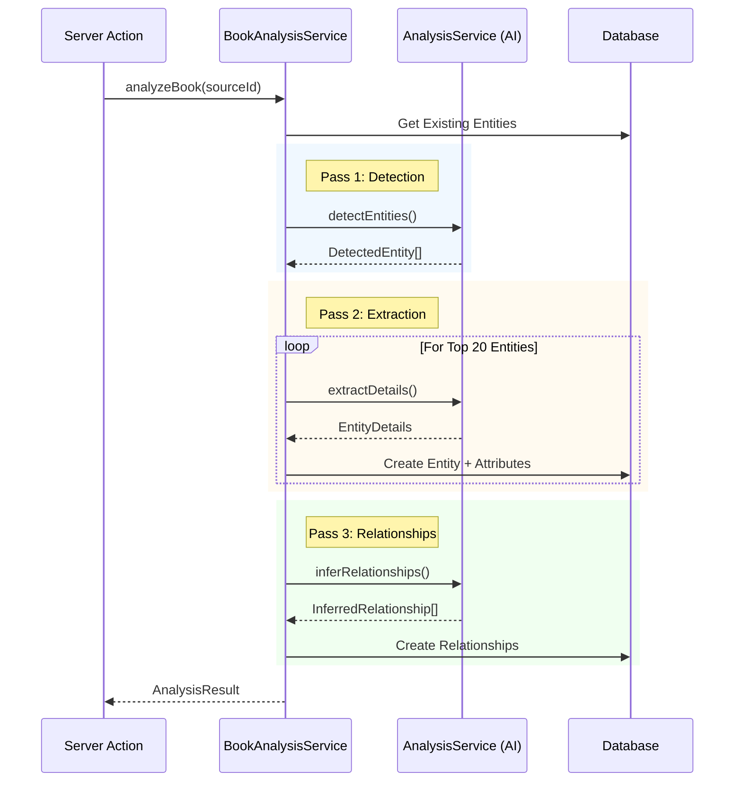

# AI Services & Architecture

This document details the underlying AI infrastructure, including model selection strategies, RAG implementation, and the chat transport layer.

## Model Routing Strategy

The application uses a **Role-Based Routing** system defined in `lib/ai/model-routing.ts`. Instead of hardcoding models in every component, we assign specific models to functional roles.

### Roles

| Role | Purpose | Default Model | Why? |
| :--- | :--- | :--- | :--- |
| **Orchestrator** | Planning, outlining, complex logic | `Claude 3.5 Opus` | Requires highest reasoning capability to maintain structural coherence. |
| **Writer** | Prose generation, creative writing | `Claude 3.5 Sonnet` | Best balance of creative nuance, prose quality, and speed. |
| **Checker** | Reviewing, consistency checking | `DeepSeek V3 (Reasoner)` | Excellent at logic and finding contradictions; cost-effective. |
| **Context** | Large context processing | `Gemini 1.5 Pro` | Massive context window allows ingesting entire books for analysis. |

### Configuration
While these defaults are hardcoded in `ROLE_MODEL_MAP`, the system is designed to check for user-configured overrides (persisted in cookies or user settings) before falling back to the defaults.

## Retrieval-Augmented Generation (RAG)

The project employs a persistent **Semantic Cache** strategy implemented in `lib/ai/semantic-cache.ts` to power RAG operations.

### Architecture
-   **Storage**: Vercel Blob (`projects/${projectId}/semantic-cache.json`).
-   **Structure**: A JSON file containing embeddings for Scenes, Characters, and Chapters.
-   **Updates**: The cache is lazy-loaded and updated via `updateCache(projectId)`. It syncs with the database (checking `updatedAt` timestamps) and only generates new embeddings for modified content.
-   **TTL**: 5 minutes (in-memory optimization to avoid fetching Blob on every request).

### Usage
RAG is primarily used to "flood" the context window with relevant story elements during generation, ensuring the AI respects established lore without manual input.

## Context Strategies

We employ two distinct strategies for context construction, depending on the generation mode:

### 1. Deterministic Context (Standard)
*File: `src/lib/services/story/story-context-builder.ts`*

Used by the **Batch Writer** (`StoryService`). It prioritizes narrative structure over semantic relevance.
-   **Composition**:
    1.  Target Chapter Notes.
    2.  Summaries of *all* previous scenes in the chapter (Narrative Arc).
    3.  Full text of the *immediately preceding* scene (Continuity).
-   **Smart Truncation**: A utility that trims text to ~2000 chars but strictly respects sentence boundaries to prevent hallucinations.

### 2. Semantic Context (Advanced)
*File: `src/lib/ai/context-builder.ts`*

Used by the **Writer View** (`generateScene` action) for interactive generation. It combines deterministic continuity with semantic search.
-   **Composition**:
    1.  Target Chapter & Previous Scene (Deterministic).
    2.  **Semantic Injection**: Queries the `SemanticCache` for the top 5 most relevant Entities, Plot Points, and Past Scenes based on the current chapter context.
-   **Benefit**: This allows the AI to recall a character mentioned 10 chapters ago if they are relevant to the current scene's themes.

## Analysis Architecture

The project features a multi-layered architecture for analyzing books and extracting structured data (Entities, Relationships).

### 1. Business Logic Orchestrator (`lib/services/book-analysis-service.ts`)
This is the high-level service consumed by Server Actions. It manages the analysis pipeline state and database transactions.
-   **Responsibility**:
    -   Verifies source material status.
    -   Prevents duplicate entity creation (filters against existing project entities).
    -   Orchestrates the 3-pass process (Detect -> Extract -> Infer).
    -   Saves results (Entities, Attributes, Relationships) to the database.

### 2. AI Service Wrapper (`lib/ai/services/analysis-service.ts`)
This layer handles the direct interaction with the LLM. It extends `BaseAIService` and encapsulates the prompt engineering and RAG logic.
-   **Key Methods**:
    -   `detectEntities(sourceMaterialId)`: Scans sampled chunks to identify potential entities.
    -   `extractDetails(name, kind, sourceMaterialId)`: Uses RAG to find relevant text and extract detailed attributes/quotes.
    -   `inferRelationships(entities, sourceMaterialId)`: Analyzes co-occurrence of entities to infer relationships.

### Data Flow

## Chat Transport Layer

The `ChatTransport` (`lib/ai/chat-transport.ts`) serves as the abstraction layer between the UI and the Vercel AI SDK.

- **Responsibility**: It standardizes how messages are sent, how tools are invoked, and how errors are handled.
- **Dynamic Configuration**: It accepts getter functions for `projectId` and `modelId` to ensure that long-lived chat hooks always access the current application state.
