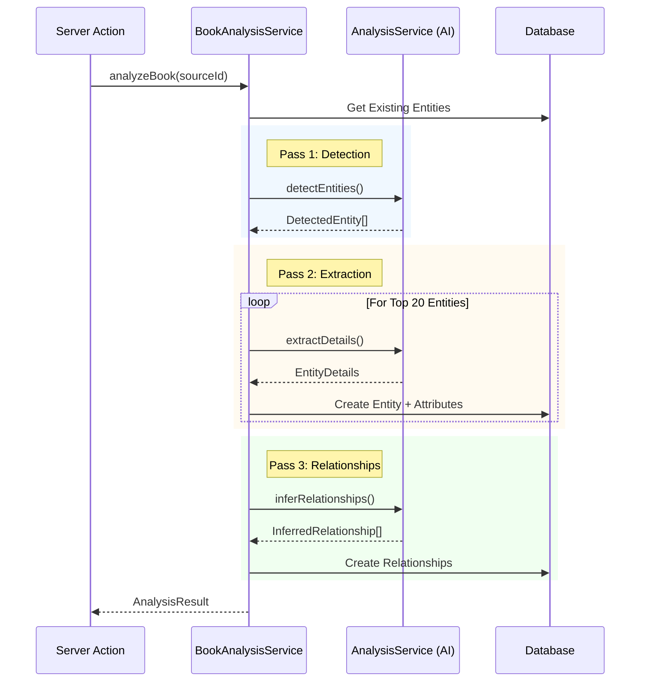

# AI Services & Architecture

This document details the underlying AI infrastructure, including model selection strategies, RAG implementation, and the chat transport layer.

## Model Routing Strategy

The application uses a **Role-Based Routing** system defined in `lib/ai/model-routing.ts`. Instead of hardcoding models in every component, we assign specific models to functional roles.

### Roles

| Role | Purpose | Default Model | Why? |
| :--- | :--- | :--- | :--- |
| **Orchestrator** | Planning, outlining, complex logic | `Claude 3.5 Opus` | Requires highest reasoning capability to maintain structural coherence. |
| **Writer** | Prose generation, creative writing | `Claude 3.5 Sonnet` | Best balance of creative nuance, prose quality, and speed. |
| **Checker** | Reviewing, consistency checking | `DeepSeek V3 (Reasoner)` | Excellent at logic and finding contradictions; cost-effective. |
| **Context** | Large context processing | `Gemini 1.5 Pro` | Massive context window allows ingesting entire books for analysis. |

### Configuration
While these defaults are hardcoded in `ROLE_MODEL_MAP`, the system is designed to check for user-configured overrides (persisted in cookies or user settings) before falling back to the defaults.

## Retrieval-Augmented Generation (RAG)

The project currently employs a **Session-Scoped In-Memory RAG** implemented in `lib/ai/rag.ts`.

### Current Implementation
- **Storage**: `Map<string, number[]>` (In-Memory Cache).
- **Scope**: Per-request/Per-generation.
- **Embedding Model**: `text-embedding-3-small`.
- **Strategy**: "Just-in-Time" embedding. When a context selection is made, we embed the candidates on the fly and cache them for the duration of the session.

### Why In-Memory?
For many "Book Generation" tasks, we can fit the entire relevant context (Entity Bible + Outline) into the context window of modern LLMs (200k+ tokens). We rely on **Context Flooding** rather than retrieval for the primary generation loop to avoid "retrieval misses."

RAG is primarily used for:
1.  **Chat**: Quickly finding relevant entities in a large project during a chat session.
2.  **Consistency Checks**: Verifying specific details against a large corpus.

## Structured Context Construction

While RAG is used for broad searching, narrative generation requires a highly deterministic context structure to ensure continuity. This is handled by `src/lib/services/story/story-context-builder.ts`.

### Smart Truncation
Naive truncation of text (e.g., `text.slice(-2000)`) often cuts sentences in half, leading the LLM to hallucinate the completion or become confused about the sentence structure.

We employ a `smartTruncate` utility that:
1.  Takes the last `N` characters.
2.  Searches forward for the first valid sentence boundary (`. `, `? `, `! `, or `\n`).
3.  Returns the text *starting from the next complete sentence*.

This ensures that the "Immediately Previous Context" injected into the prompt is always grammatically complete.

### Context Composition
The prompt context for a scene generation is composed of:
1.  **Target Chapter**: Title and Notes.
2.  **Previous Scenes Summary**: A compiled list of summaries for all preceding scenes in the chapter (to maintain the arc).
3.  **Immediate Predecessor**: The *full text* (smartly truncated to ~2000 chars) of the scene immediately before the target (to maintain style and flow).

## Analysis Architecture

The project features a multi-layered architecture for analyzing books and extracting structured data (Entities, Relationships).

### 1. Business Logic Orchestrator (`lib/services/book-analysis-service.ts`)
This is the high-level service consumed by Server Actions. It manages the analysis pipeline state and database transactions.
-   **Responsibility**:
    -   Verifies source material status.
    -   Prevents duplicate entity creation (filters against existing project entities).
    -   Orchestrates the 3-pass process (Detect -> Extract -> Infer).
    -   Saves results (Entities, Attributes, Relationships) to the database.

### 2. AI Service Wrapper (`lib/ai/services/analysis-service.ts`)
This layer handles the direct interaction with the LLM. It extends `BaseAIService` and encapsulates the prompt engineering and RAG logic.
-   **Key Methods**:
    -   `detectEntities(sourceMaterialId)`: Scans sampled chunks to identify potential entities.
    -   `extractDetails(name, kind, sourceMaterialId)`: Uses RAG to find relevant text and extract detailed attributes/quotes.
    -   `inferRelationships(entities, sourceMaterialId)`: Analyzes co-occurrence of entities to infer relationships.

### Data Flow

## Chat Transport Layer

The `ChatTransport` (`lib/ai/chat-transport.ts`) serves as the abstraction layer between the UI and the Vercel AI SDK.

- **Responsibility**: It standardizes how messages are sent, how tools are invoked, and how errors are handled.
- **Dynamic Configuration**: It accepts getter functions for `projectId` and `modelId` to ensure that long-lived chat hooks always access the current application state.
