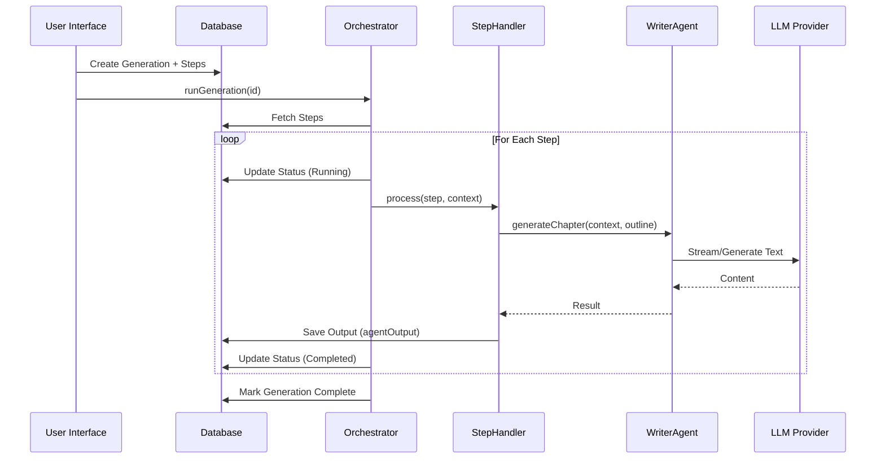

# Generation Architecture

The Book Generation system in AI Book World Builder is a **state-driven, multi-agent pipeline** designed to create coherent long-form content. It prioritizes consistency, context-awareness, and fault tolerance.

## Core Components

### 1. Generation Orchestrator
The `GenerationOrchestrator` (`lib/generation/generation-orchestrator.ts`) is the central engine. It does not run in a single long-lived process but rather executes a sequence of database-persisted steps.

- **State Machine**: The generation process is defined by a series of `bookGenerationStep` records in the database.
- **Resiliency**: Because state is persisted, the generation can be paused, resumed, or recovered after a server restart.
- **Context Management**: The orchestrator builds a `ProcessStepContext` containing the project's lore, outline, and global notes, which is passed to every step.

### 2. Step Handlers
Each phase of generation is handled by a specific `StepHandler` implementation. These are located in `lib/generation/steps/`.

**Interface:**
```typescript
interface StepHandler {
  process(step: BookGenerationStep, context: ProcessStepContext): Promise<void>;
}
```

**Available Steps:**
- **Prologue**: Generates an introductory scene.
- **Chapter Writing**: The core step. Uses the `WriterAgent` to generate a chapter based on the outline.
- **Chapter Reviewing**: Uses a separate "Reviewer" model to critique the generated chapter and suggest improvements (or auto-fix).
- **Epilogue**: Generates the concluding scene.
- **Consistency Check**: Analyzes the generated content against the project's entity database to find contradictions.
- **Back Cover**: Generates a blurb or marketing copy for the book.

### 3. Writer Agent
The `WriterAgent` (`lib/generation/writer-agent.ts`) is responsible for the actual prose generation. It operates on a "Context Flooding" principle.

- **Inputs**: It receives the *entire* relevant context (Project Context, Lore, Outline, Previous Chapter Summary).
- **Prompt Engineering**: It constructs a massive system prompt that enforces the selected "Writing Style" (e.g., Hemingway, Tolkien) and specific author instructions.
- **Output**: Returns raw text, word count, token usage, and model metadata.

## Data Flow Diagram



## Observability & Callbacks

The pipeline is decoupled from the UI. Communication happens via the `GenerationCallbacks` interface (`src/lib/generation/step-logger.ts`).

```typescript
export interface GenerationCallbacks {
  onStepStart?: (step: BookGenerationStep) => void;
  onStepComplete?: (step: BookGenerationStep) => void;
  onLog?: (message: string, type: "writer" | "reviewer" | "orchestrator") => void;
  onProgress?: (completed: number, total: number) => void;
  onError?: (error: Error, step?: BookGenerationStep) => void;
}
```

-   **Backend**: The `StepExecutionLogger` wraps these callbacks. It logs to the console/stdout (for server logs) AND invokes the callback (for real-time UI updates via streaming or websockets).
-   **Frontend**: When triggering a generation, the UI provides these callbacks to update progress bars, current step indicators, and log panels.

## Extending the Pipeline

### How to Add a New Generation Step

1.  **Define the Step Type**:
    Add a new string literal to the `step_type` enum in the database schema (`src/lib/db/schema.ts`) if necessary, or just ensure your code handles the new string key.

2.  **Create the Handler**:
    Create a new file in `src/lib/generation/steps/` (e.g., `marketing-copy.ts`) implementing `StepHandler`.

    ```typescript
    import { StepHandler, ProcessStepContext } from "./types";

    export class MarketingCopyHandler implements StepHandler {
      async process(step: BookGenerationStep, context: ProcessStepContext): Promise<void> {
        context.log("Generating marketing copy...");
        // 1. Construct Prompt
        // 2. Call AI
        // 3. Save Result
      }
    }
    ```

3.  **Register the Handler**:
    Add your new handler to the `stepHandlers` map in `src/lib/generation/pipeline.ts`.

    ```typescript
    const stepHandlers: Record<string, StepHandler> = {
      // ... existing
      marketing_copy: new MarketingCopyHandler(),
    };
    ```

## Key Concepts

### Context Flooding
Instead of using RAG for every small detail during generation, we "flood" the context window of long-context models (like Claude 3.5 Sonnet or Gemini 1.5 Pro) with:
1.  **Project Context**: High-level description.
2.  **Lore Context**: All entities (Characters, Locations) relevant to the book.
3.  **Outline**: The structural plan for the book.

This ensures the model has "random access" to all necessary facts without retrieval errors.

### Optimistic Concurrency
The orchestrator checks for `paused` or `cancelled` status before starting each step, allowing users to intervene in the middle of a long generation process.

### Model Routing
The system allows configuring different models for different roles:
- **Writer Model**: Optimized for prose and creativity (e.g., Claude 3.5 Sonnet).
- **Reviewer Model**: Optimized for reasoning and critique (e.g., GPT-4o or DeepSeek R1).
- **Orchestrator Model**: Optimized for speed and structure (e.g., Gemini Flash).
