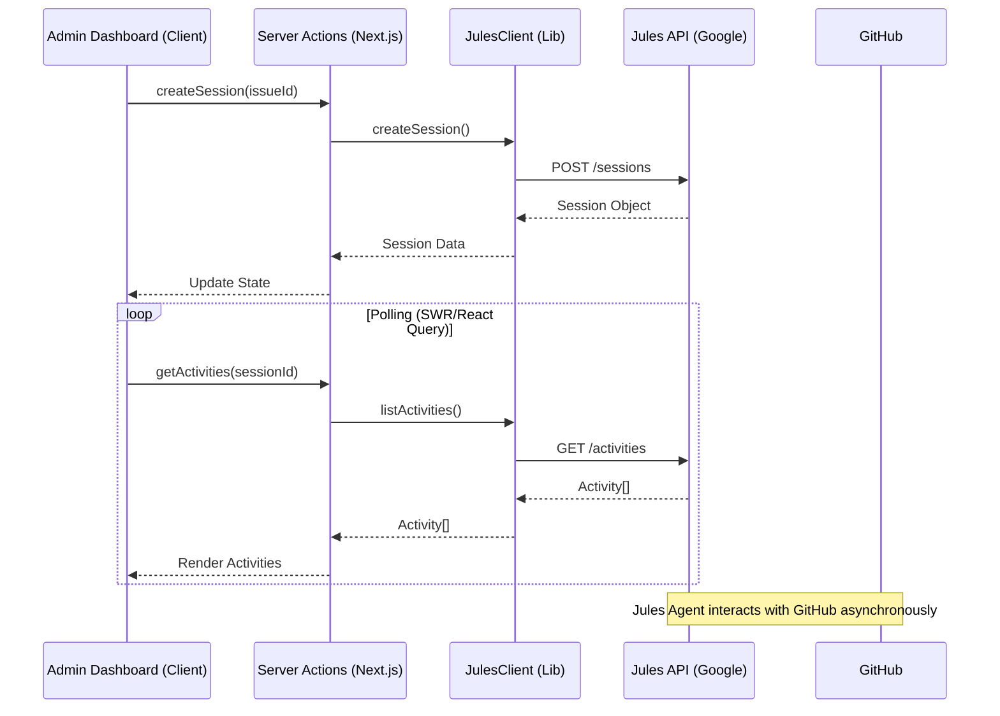

# Jules Integration Guide

This document provides a technical deep-dive into the **Jules Integration**, the system powering the "Software Builder" (Admin Dashboard). It allows the application to interact with the Google Jules Agent for automated software development tasks.

## Architecture

The integration follows a **Client-Server-API** pattern:



## Jules Client (`lib/jules-client.ts`)

The `JulesClient` is a typed wrapper around the Google Jules API (`https://jules.googleapis.com/v1alpha`).

### Initialization
It requires the `JULES_API_KEY` environment variable.

```typescript
import { JulesClient } from "@/lib/jules-client";

const jules = new JulesClient(); // Auto-loads process.env.JULES_API_KEY
```

### Key Concepts

#### 1. Sessions (`JulesSession`)
A session represents a continuous interaction thread with the agent.
-   **State Machine**: `QUEUED` -> `PLANNING` -> `AWAITING_PLAN_APPROVAL` -> `IN_PROGRESS` -> `COMPLETED`.
-   **Context**: Sessions are initialized with a `sourceContext` (GitHub Repo) and a `prompt`.

#### 2. Activities (`JulesActivity`)
The agent's history is an append-only log of "Activities". We query these to render the chat UI.
Crucially, `JulesActivity` is a **discriminated union** of event types:

| Event Field | Description | Payload |
| :--- | :--- | :--- |
| `planGenerated` | Agent proposes a plan | `{ plan: JulesPlan }` |
| `planApproved` | User approved the plan | `{ planId: string }` |
| `agentMessaged` | Agent text response | `{ agentMessage: string }` |
| `userMessaged` | User text input | `{ userMessage: string }` |
| `sessionCompleted` | Task finished | `{}` |

#### 3. Artifacts (`JulesArtifact`)
Activities can contain **Artifacts**, which are tangible outputs of the agent's work.
-   `changeSet`: A Git patch (diff) showing code changes.
-   `bashOutput`: The stdout/stderr of a command executed by the agent.

## UI Components (`components/admin/jules/`)

The UI is built to consume the Activity stream and render it interactively. The architecture is hierarchical:

### `JulesDashboard`

Located in `src/components/admin/jules/jules-dashboard.tsx`.
-   **Purpose**: The top-level container component for the admin page.
-   **Responsibility**:
    -   Fetches available sources (repositories).
    -   Manages the "Session List" vs "Chat" view state.
    -   Renders `CreateSessionDialog` for initializing new tasks.

### `JulesSessionList`

Located in `src/components/admin/jules/jules-session-list.tsx`.
-   **Purpose**: Displays a history of all agent sessions.
-   **Features**:
    -   Shows status badges (Running, Completed, Queued).
    -   Displays the original prompt or "Intent".
    -   Allows navigation into a specific session.

### `JulesChat`

Located in `src/components/admin/jules/jules-chat.tsx`.
-   **Purpose**: The main interaction view for a single active session.
-   **Logic**:
    -   Polls for new activities using `useQuery`.
    -   Differentiates between "System" events (Plans) and "Chat" events (Messages).
    -   Provides controls for "Approve Plan" or "Abort" based on the current `session.state`.

### `ArtifactRenderer`

Located in `src/components/admin/jules/artifact-renderer.tsx`.
-   **Purpose**: Renders complex artifacts within the chat stream.
-   **Features**:
    -   **Bash Output**: Collapsible terminal view with exit codes (Green/Red).
    -   **Git Patches**: Collapsible diff view with syntax highlighting (via simple pre-wrap).

## Server Actions

All Jules interactions are proxied through Server Actions in `src/app/actions/jules.ts` (or similar).
**Security Note**: These actions MUST enforce `requireAdmin()` to prevent unauthorized usage of the Jules quota.

## Troubleshooting

| Error | Cause | Fix |
| :--- | :--- | :--- |
| `403 Forbidden` | Invalid API Key or Quota | Check `JULES_API_KEY` in `.env.local`. |
| `400 Bad Request` | Invalid Source Name | Ensure `GITHUB_OWNER/REPO` matches the format expected by Jules. |
| `Stuck in QUEUED` | Agent Overload | Retry later; usually resolves automatically. |
